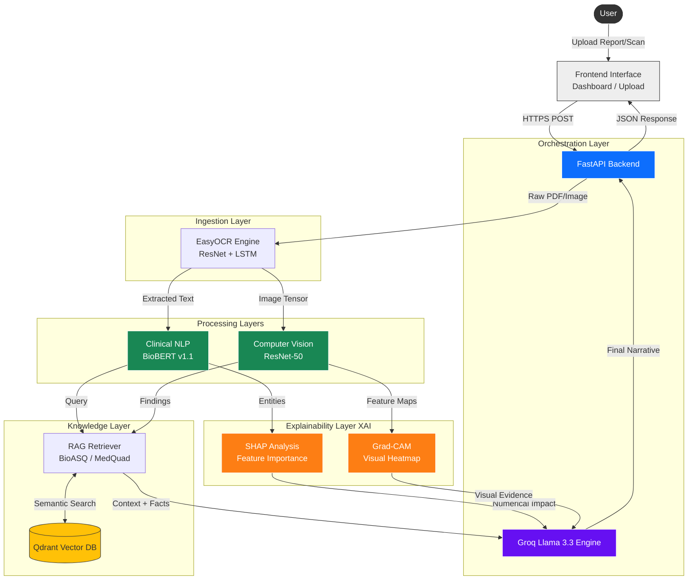

# MediExplain System Arch
> Multimodal Explainable AI (XAI) Pipeline

This document outlines the technical architecture of MediExplain, categorized into six distinct layers that function as a cohesive intelligent system.

## 1. The Clinical NLP Layer: BioBERT (The "Brain")
*   **Technology**: BioBERT v1.1
*   **Role**:
    *   **Clinical NER**: Identifies biomarkers (e.g., Creatinine, LDL) and pathologies.
    *   **Medical Translation**: Decodes complex nomenclature into patient-friendly language.

## 2. The Computer Vision Layer: ResNet-50 (The "Eyes")
*   **Technology**: CNN ResNet-50
*   **Role**:
    *   **Pathology Classification**: Classifies X-ray and MRI regions as "Normal" or "Abnormal".
    *   **Feature Extraction**: Detects densities, fractures, and organ borders using deep residual connections.

## 3. The Explainability Layer: Grad-CAM & SHAP (The "Why")
*   **Grad-CAM (Visual XAI)**: Overlays heatmaps on medical scans to highlight decision regions.
*   **SHAP (Numerical XAI)**: Quantifies the influence of specific lab values on the overall health urgency score.

## 4. The Knowledge Grounding Layer: RAG (The "Source of Truth")
*   **Technology**: Qdrant Vector DB + BioASQ/MedQuad Datasets
*   **Role**:
    *   **Fact Checking**: Anchors outputs in verified medical guidelines.
    *   **Hallucination Prevention**: Constrains the LLM to retrieved context.

## 5. The Ingestion Engine: EasyOCR
*   **Technology**: EasyOCR (ResNet + LSTM)
*   **Role**: Preserves spatial alignment of tabular data in scanned reports, ensuring accurate key-value pair extraction.

## 6. The Orchestration Layer: FastAPI & Groq (The Infrastructure)
*   **Groq Llama 3.3 (70B)**: The "Linguistic Interface" synthesizing the final narrative.
*   **FastAPI**: The asynchronous nervous system coordinating all services.

---

## Architecture Diagram

## Data Flow Summary
1.  **Ingestion**: User uploads a report. EasyOCR digitizes the content, preserving structure.
2.  **Analysis**:
    *   **Text**: BioBERT extracts clinical entities. SHAP calculates their risk contribution.
    *   **Vision**: ResNet-50 detects pathologies. Grad-CAM generates a heatmap of the focus area.
3.  **Grounding**: The system queries Qdrant to retrieve relevant medical literature (RAG).
4.  **Synthesis**: Groq Llama 3 combines the clinical findings, XAI insights, and retrieved context into a patient-friendly narrative.
5.  **Delivery**: FastAPI delivers the structured JSON and narrative to the frontend.
